<div align="center">

# 🏁 PITWALL: The Impossible Pit Stop

**A race simulator and live strategy dashboard for the Daytona road course.**
**Three strategists race the same car on the same luck. Only one can be the smartest.**


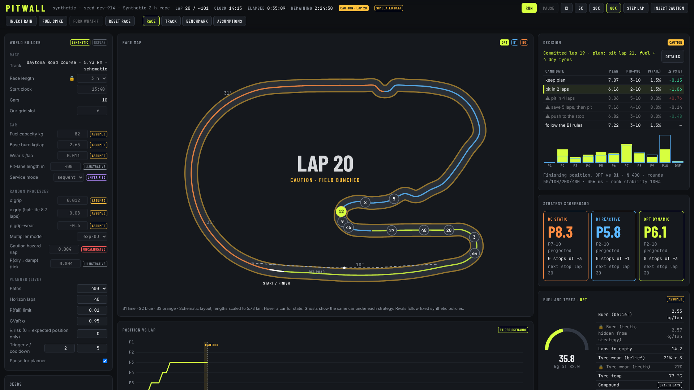

</div>

---

## 📻 "Box, box!" — but *when*?

If you watch F1, you know the moment. Lap 30, the tyres are fading, the car ahead is about to pit, and somewhere on the pit wall a strategist has three seconds to decide: **stay out, pit now, or wait for the safety car that might never come.** Races are won and lost on that call.

PITWALL turns that moment into a simulator you can play with. It races a full field of ten GT3-class cars around a (schematic) Daytona road course for 1, 3 or 6 hours. Tyres wear, fuel burns, rain rolls in, cautions bunch the field. And our car, **#12**, is driven by three different strategists **at the same time**, in three parallel universes that share the exact same weather, crashes and luck:

| | Strategist | Personality | How it decides |
|---|---|---|---|
| 🟠 | **B0 · Static** | "The spreadsheet" | Plans every stop before the green flag (laps 30, 60, 90) using exact dynamic programming, then sticks to it. |
| 🔵 | **B1 · Reactive** | "The old-school crew chief" | Simple rules: low on fuel → pit; caution and the tank is half used → pit; tyres old → pit; it's raining → wets. |
| 🟢 | **OPT · Dynamic** | "The data nerd" | Guesses the hidden tyre wear and fuel from lap times, imagines 400 possible futures for every option, and only changes plan when the maths is clearly better. |

Because all three live in the same universe-with-the-same-dice, any difference at the flag is **pure strategy**, not luck. That's the whole trick.

<div align="center">
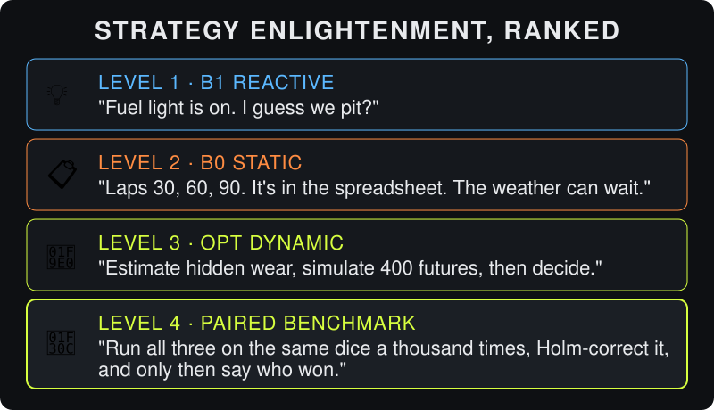
</div>

> ⚠️ Everything here is **synthetic**. The car, the rivals, the hazard rates and many track details are invented or illustrative, and every number carries a provenance tag (`REPORTED`, `ILLUSTRATIVE`, `ASSUMED`, `UNCALIBRATED`, `UNVERIFIED`, `FITTED`). PITWALL compares strategies under stated assumptions. It does not predict real races, and it never controls a real car.

---

## 🚦 Lights out: run it in 60 seconds

You need Node.js 20 or newer and pnpm 10.

```bash
pnpm install
pnpm dev     # server on http://127.0.0.1:8787, dashboard on http://127.0.0.1:5173
```

Open the dashboard and press **RUN**. The first run takes 2–3 seconds while it calibrates the car. Then:

- crank the speed to **20×** or **60×**,
- smash **INJECT CAUTION** and watch the field bunch up and the strategists argue,
- hit **INJECT RAIN** and see who gambles on wets first,
- press **FORK WHAT-IF** to replay the race with a different call ("what if we'd pitted on lap 31?").

Keyboard: `Space` run/pause · `1`–`4` speed · `S` step a lap · `C` caution · `R` rain.

---

## 🧠 How it works, in plain English

### The big picture

```mermaid
flowchart LR
    A["🎲 Random streams<br/>seeded, shared by all 3 worlds"] --> B["🌧️ Weather & hazards<br/>rain, cautions, crashes"]
    B --> C["🛣️ Track grip<br/>wetness, heat, rubber"]
    C --> D["🛞 Car grip & mass<br/>tyres, fuel, hidden multipliers"]
    D --> E["⚙️ Lap-time physics<br/>banked-corner solver"]
    E --> F["🏎️ Race engine<br/>10 cars × 3 parallel worlds"]
    F --> G["📡 What the pit wall sees<br/>noisy fuel gauge, lap times, gaps"]
    G --> H["🔍 Estimator<br/>Kalman filter guesses the hidden state"]
    H --> I["🧑‍💼 Strategist<br/>B0 · B1 · OPT"]
    I -- "pit? fuel? tyres? push?" --> F
```

Read it like a race weekend: the dice decide the weather and the drama, physics turns grip into lap times, the race engine runs every car, and the strategists only ever see what a real pit wall would see — never the truth.

### Three parallel universes, one set of dice

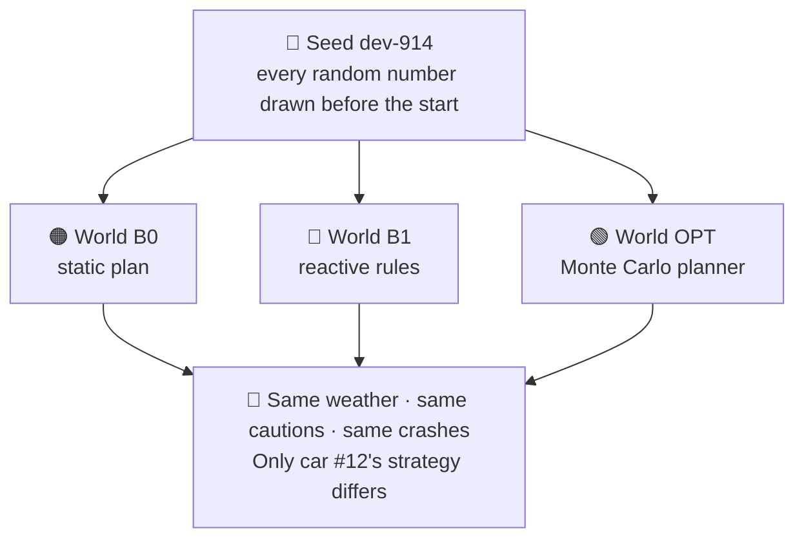

This is what scientists call a **paired experiment**. If OPT finishes P4 and B1 finishes P6 in the same universe, OPT really did gain two places. Run a few hundred seeds and you can say how often and by how much, with proper confidence intervals.

### What makes a lap fast (or slow)

- **Grip** comes from the track (wet or dry, hot or cold, rubbered-in or green) times the tyres (right temperature? how worn?) times a hidden "today the car feels good" multiplier.
- **Physics** turns grip, weight and power into a speed for every 2 m of track — braking for the Bus Stop chicane, flat out round the 31° banking. A calibrated reference lap is 107 s, with a top speed of about 289 km/h.
- **Fuel** makes the car heavy (about 0.01 s per kg) and runs out if you get greedy.
- **Tyres** fade gently, then fall off a cliff:

<div align="center">
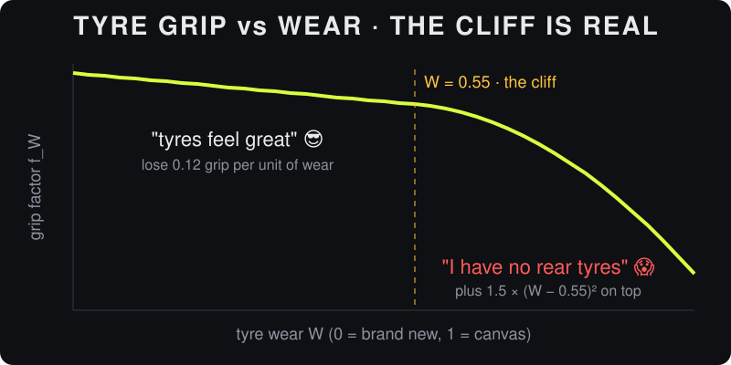
</div>

- **Traffic and dirty air** cost a few tenths; a random residual keeps every lap slightly different.

### Why cautions change everything

When a caution comes out, everyone slows behind the pace car. A pit stop still takes the same time in the pit lane, but the cars on track are crawling, so you lose much less ground.

<div align="center">
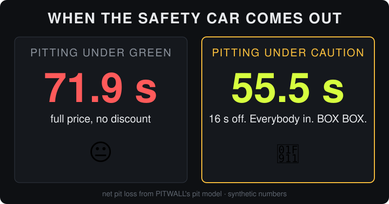
</div>

That 16-second discount is why strategists pray for a caution in their pit window — and why pitting one lap *before* one is the worst feeling in motorsport (that's benchmark family **F10, "worst timing"**).

### A pit stop, leg by leg

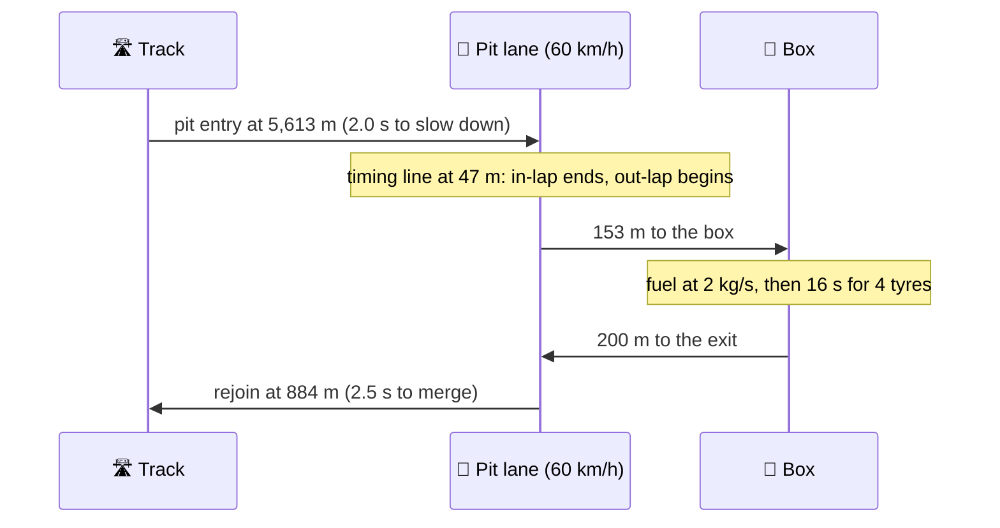

Full stop: about **84.5 s** in the lane, about **71.9 s** lost against staying out under green.

### How OPT actually thinks

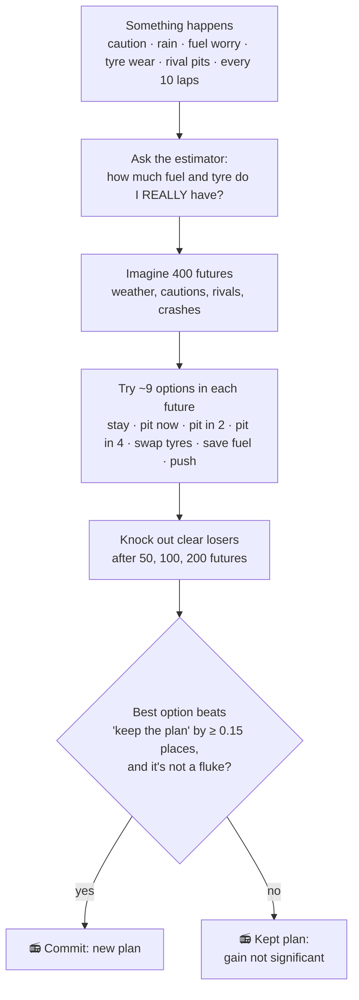

Every candidate is tested on the **same** 400 futures, so the comparison is fair. OPT also checks it isn't trading a better average for a bigger chance of running out of fuel, and it won't flip-flop: a change needs a real gain, a confidence interval below zero and (unless it's urgent) three laps since the last change.

<div align="center">
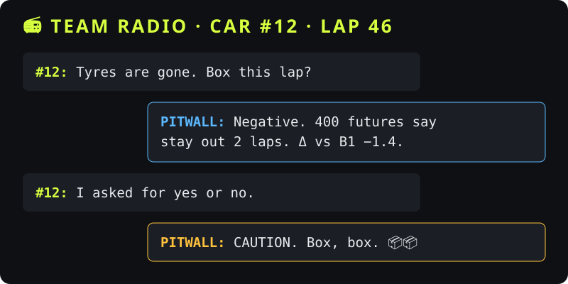
</div>

---

## 📸 Tour of the dashboard

### Race tab

| | |
|---|---|
| 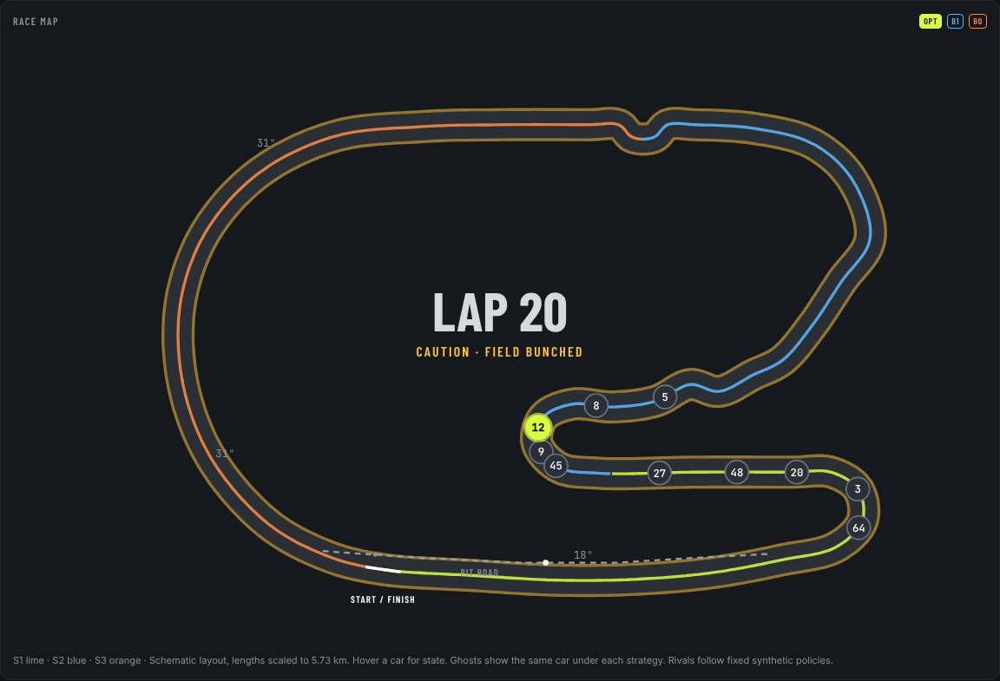 | **Race map.** The schematic Daytona road course with all ten cars moving in real time. Our car is the glowing lime #12; hollow rings are "ghosts" of #12 in the other two universes. The track glows amber under caution and turns blue as it gets wet. Hover any car for its gap, lap time, tyres and (for us) the estimated fuel and wear. |
| 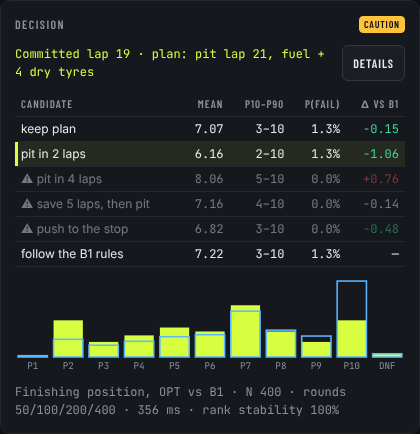 | **Decision.** Every time OPT thinks, you see its full working: each option's average finishing position, the P10–P90 range, the chance of a DNF and the gain against B1. The histogram compares OPT's predicted finishing positions (lime) with B1's (blue). |
| 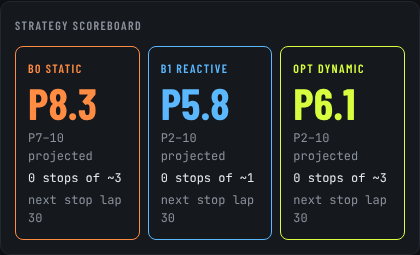 | **Strategy scoreboard.** Projected finishing position for each strategist, their uncertainty range and their next planned stop. |
| 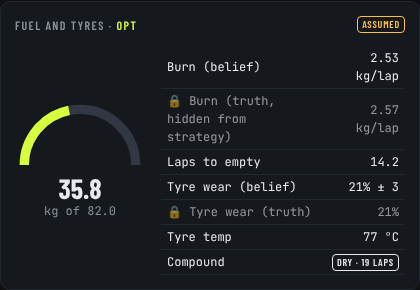 | **Fuel and tyres.** What OPT *believes* (fuel gauge, burn rate, tyre wear) next to the hidden truth, marked with a lock. A great way to watch a Kalman filter learn. |

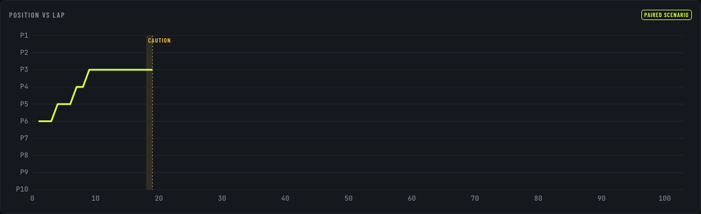

**Position vs lap** shows all three strategists' #12 on one chart, with caution periods shaded and pit stops marked as dots.

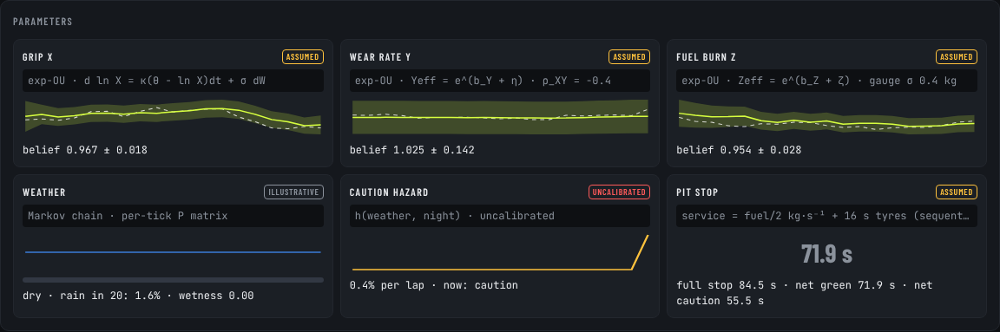

**Parameters** show the hidden grip, wear and burn multipliers: the belief as a line with a ±2σ band, the truth as a dashed line, plus weather, caution hazard and pit-stop cards.

### Track tab

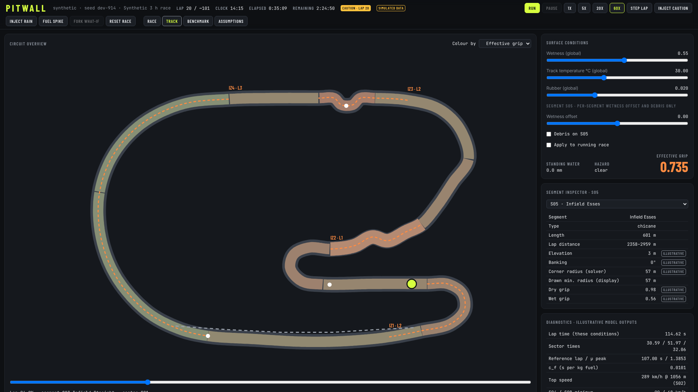

Paint the circuit by grip, segment type or wetness. Drag the sliders to make it rain or heat the asphalt, drop debris in the Bus Stop, and the effective grip and lap time update from the same physics the race uses.

### Assumptions tab

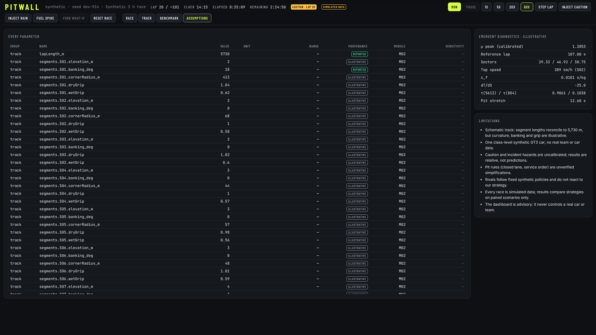

Every single number in the model with its provenance badge, its range and the module that uses it. Hit **Sensitivity** on any assumed value to see whether it changes who wins.

### Benchmark tab

Pick scenario families, a number of seeds and a split, and PITWALL races them all headless, then reports who won with bootstrap confidence intervals, a forest plot and CSV/JSON export.

---

## 🧪 Simulations you can run

| Scenario family | What happens | Real-world flavour |
|---|---|---|
| F1 Calm dry | no rain, half the usual cautions | the "boring" race where strategy is pure arithmetic |
| F2 / F3 / F4 | a caution at 15%, 50% or 85% of the race | early, mid and late safety cars |
| F5 Random cautions | default chaos | a normal race day |
| F6 Rain onset | damp, then wet, somewhere mid-race | the slicks-or-wets gamble |
| F7 High wear | tyres wear 1.5× faster, track 8 °C hotter | a tyre-management race |
| F8 Fuel stress | burn 4% higher, noisier fuel gauge | "lift and coast, please" |
| F9 Model mismatch | cars far more different than the strategist assumes | when your data is wrong |
| F10 Worst timing | caution one lap after B1's first stop | the pain of the unlucky undercut |
| F10-adv | caution right after *each* strategist's own first stop | maximum pain for everyone |

Plus six experiments (GBM vs mean-reverting randomness, grip volatility, grip–wear correlation, an "oracle" OPT that is told the truth, seed-set stability, hazard scaling) and one-click sensitivity on any assumption.

---

## 📐 The maths (for the curious)

Under the hood every piece is a real model, not a lookup of made-up lap times:

- **Hidden multipliers** follow an exponential Ornstein–Uhlenbeck process: geometric Brownian motion in log space plus a pull back to normal, so they drift but don't wander off.
- **Lap times** come from a quasi-steady-state solver on banked corners (friction circle, downforce, drag, power limit), calibrated to a 107 s reference lap and compressed into a fast lookup table.
- **Weather** is a three-state Markov chain with an exact rain forecast.
- **The estimator** is a pair of (extended) Kalman filters for fuel and grip/wear, with an outlier gate for traffic.
- **B0** solves the pit plan exactly with dynamic programming; **OPT** uses Monte Carlo rollouts with common random numbers and deterministic successive halving.
- **The benchmark** uses paired differences, bootstrap and t intervals, Wilson intervals, McNemar's test and Holm–Bonferroni correction.

Every formula with its derivation and reasoning lives in the full spec under [`docs/spec`](docs/spec/README.md).

---

## 🏗️ Under the hood

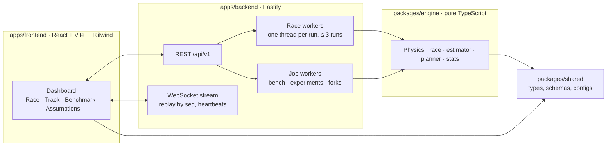

| Folder | What's inside |
|---|---|
| `packages/shared` | types, Zod schemas and default configs (track, car, race, field, planner) with provenance |
| `packages/engine` | the simulation: RNG streams (M01), track (M02), physics and surrogate (M03), tyres and fuel (M04), weather (M05), hazards (M06), pit stops (M07), race engine (M08), rivals (M09), B0/B1 (M10), estimator (M11), OPT (M12), benchmark (M13), forks |
| `apps/backend` | Fastify REST + WebSocket server, race and job worker threads, event store |
| `apps/frontend` | the PITWALL dashboard |
| `docs/spec` | the full implementation specification |

### Commands

| Command | What it does |
|---|---|
| `pnpm dev` | server (auto-reload) + dashboard dev server |
| `pnpm start` | server only (`PORT`, `HOST`, `PITWALL_DATA_DIR` for JSONL logs, `PITWALL_FROZEN_SETTINGS` for test-split benches, `PITWALL_BENCH_HOURS` to shorten bench races) |
| `pnpm build` | production build of the dashboard |
| `pnpm test` | shared + engine + backend tests (Vitest) |
| `pnpm --filter frontend test` | dashboard unit and smoke tests |
| `pnpm --filter frontend test:e2e` | Playwright caution scenario against a running server (`PW_CHROMIUM` can point at a local Chromium) |
| `pnpm typecheck`, `pnpm lint` | TypeScript and ESLint, including the engine's determinism and import-boundary rules |

### Same seed, same race. Always.

Every random number comes from a seeded xoshiro128** stream and is drawn before the green flag. The planner does a fixed amount of work (the clock is only measured, never obeyed). Rerun a seed with the same settings and injections and you get the same race, byte for byte — the tests check it through the API, across planner thread counts and under hidden-truth changes the strategists can't see.

### Measured speed (2-core cloud VM)

| What | Target | Measured |
|---|---|---|
| Building the lap-time table | ≤ 2 s | ≈ 2.35 s |
| Headless 3 h race, 3 worlds, B1 everywhere | ≤ 2 s | 45–100 ms |
| One OPT decision (400 futures) | p95 ≤ 1.5 s | p50 ≈ 170 ms, p95 ≈ 290 ms |
| Full 3 h race with B0, B1 and OPT | — | ≈ 6 s |

### Honest notes (where we departed from the spec)

- **Planner placement:** the planner runs inside each race's worker instead of a shared pool. Results are identical by construction, and tests check several pool sizes.
- **No shared surrogate cache:** each race worker builds its own model (≈ 2.4 s), because worker threads don't share memory.
- **Worker loading:** worker entry points are bundled once per process with esbuild, because tsx's loader isn't inherited by worker threads.
- **Surrogate axis:** the table is stored on the effective grip axis `S_eff = S·e(w)`, with outward-only lateral demand and `V_MIN = 3 m/s`; error ≤ 0.05 s dry, ≤ 0.5% overall.
- **Estimator:** with lap time as the only wear signal, a +20% wear-rate offset can't be pinned to ±5% within 25 laps; the test checks consistency (truth within 2σ, wear error < 0.06) instead. Wear coverage is asserted at ≥ 0.87 (measured 0.90–0.97).
- **OPT plans:** a candidate's first stop is firm; after it OPT follows the B1 rules until the next decision, exactly as its rollouts assume. OPT keeps a compound-swap safety rule, and wetness crossings bypass the weather-trigger cooldown.
- **Commit stability:** grip/scheduled plan changes average ≤ 1.5 per 100 laps on calm races (spec target 1).
- **Bench smoke test** uses 1-hour races to stay fast; decision latency is excluded from the byte-identity check.
- **Heartbeats** aren't stored in the event log; they carry the latest `seq` and are ignored for ordering.
- `noUncheckedIndexedAccess` is off in `tsconfig.base.json`.
- **Results so far are mixed:** OPT beat B1 clearly in a small random-caution probe but was behind on calm dry races in an 8-seed run. Tuning on the dev split is the next step, and the benchmark reports this rather than hiding it.

---

<div align="center">

**Synthetic data only. No real timing data, no real team data.**
The track layout is schematic, with segment lengths scaled to the reported 5.73 km lap.

*Built for "The Impossible Pit Stop" hackathon. Box, box. 📦📦*

</div>
